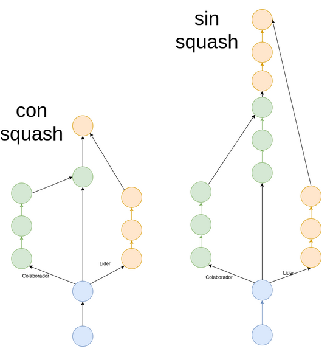
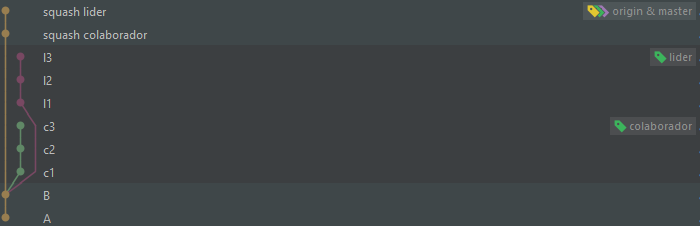

# Tarea: Git Ramas (squash)
Trabaja con un compañero. Crea un repositorio y
busca realizar el dibujo de la izquierda (utiliza merge squash).


*****
## Solución 1
> **Actualización readme 06/03/23:** Debido a que mi compañero y yo hicimos el
> trabajo antes de que se explicara la utilidad de colaborador en clases,
> resolvimos el ejercicio de forma más rudimentaria y por ello esta aclaración.
> La partes incorrectas se señalarán con :x: y la resolución con :heavy_check_mark:

|            | lider :large_blue_circle: | colaborador :green_circle: |
|------------|---------------------------|----------------------------|
|usuario     | @acastineiraduran         | @Lucasperezparracho        |

1. Seguimiento proyecto - ***commits: A y B*** :large_blue_circle:
    1. Hago primer commit en la rama _main_ para realizar
       seguimiento local del proyecto.
    2. Primera modificacion de la clase _Main_ y segundo commit.
    3. Subo el proyecto a [GitHub](<https://github.com/acastineiraduran/ramasSquash_v2.git>).
   4. :heavy_check_mark: Le doy permisos de colaborador a @Lucasperezparracho.


2. Creación rama colaborador - ***comits: c1, c2, c3*** :green_circle:
    1. Hago un `git clone <enlace-lider>` de la rama _main_
       del repositorio de mi compañero.
    2. Con el comando `git branch colaborador`
       y con `git switch colaborador` creo una nueva rama y me muevo a ella.
       Para comprobar que estamos
       en la rama _colaborador_ utilizo `git branch`.
    3. Creo una nueva clase en la carpeta _src_ llamada _ImplementacionesColaborador_.
    4. En esta clase hago 3 commits, dejando constancia con un comentario por cada
       commit realizado.
    5. :x: Subo el repo a [GitHub](https://github.com/Lucasperezparracho/ramasSquash.git) en un nuevo repositorio.
       :heavy_check_mark: Hago un `git origin push colaborador` para que suba únicamente
    la rama con la que he estado trabajando.


3. Creación rama lider - ***commits: l1, l2, l3*** :large_blue_circle:
    1. :x: Después de hacer un `git clone` del [repositorio del colaborador](https://github.com/Lucasperezparracho/ramasSquash.git).
       :heavy_check_mark: Hago un `git pull origin main` por si se ha hecho alguna
        modificación en la rama _main_ (aunque no debería). 
       
       A continuación, me posiciono en la rama _main_, y aplico los siguientes commandos en la consola:
       ```
       git branch lider
       git switch lider
       git branch
       ```
    2. Creo una nueva clase llamada _ImplementacionesLider_.
    3. Hago 3 commits en la nueva clase, dejando constancia con un comentario
       por cada commit realizado en esta nueva clase.


4. Primer squash - ***commits: squash colaborador*** :large_blue_circle:
   
    >:heavy_check_mark: Previamente podría hacer un `git checkout colaborador`
    para que me apareciese la rama de colaborador en mi repositorio local, aunque 
    esto no es necesario ya que puedo hacer el `squash` de una rama que esté en el 
    repositorio remoto.

    1. Me posiciono en la _main_ y, esta vez desde la interfaz grafica,
       realizo el
       `git merge --squash` de la rama _colaborador_.
   
       
       
    2. Compruebo que se haya modificado la _src_ con `git status`
       y realizo un commit.


5. Segundo squash - ***commits: squash lider*** :large_blue_circle:
    1. Realizo el
       `git merge --squash` de la rama _lider_.
    2. Compruebo que se haya modificado la _src_ con `git status -s`
       y realizo el ultimo commit.

### Resultado final

## Solución 2
El proceso sería el mismo, pero cambiando los roles interpretados.